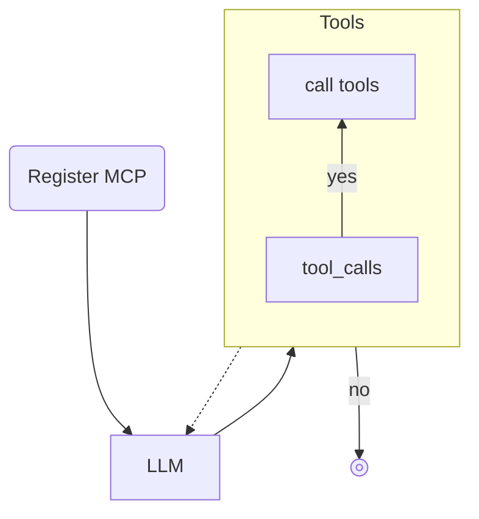

# Gwendoline

Gwendoline is a CLI based tool for interacting with language models directly from your terminal, allowing you to send prompts and receive responses via standard input and output.

## Features

Gwendonline is able to **act as an agent**, if you want:

- add a custom agent file `AGENT.md` in the current working directory
- or refer to some custom agent file by using the CLI parameter `--agent`
- add `mcp.json` in the current working directory to define MCP tools and enable MCP usage with param `--mcp`

MCP tool calling is combined with **LLM re-call** for getting evaluated output.

Optionally set more instructions with a `SYSTEM_PROMPT.md`file.

Gwendoline is able to **work with conversations** by supporting chat history. Set a chat history via `stdin` and get it back on `stdout` in chat mode by using the CLI parameter `--chat`.

## Quick Start

```sh
# create custom agent file and edit it to define the agent
nano AGENT.md

# create MCP definitions
nano mcp.json

# run Gwendoline without stdin
gwendoline --mcp

# run Gwendoline with stdin (example is using chat mode)
echo "[{\"role\": \"user\", \"content\": \"Say hello\"}]" | gwendoline --chat --mcp
```

## Dependencies

Gwendoline depends on [Ollama](https://ollama.com/) as a local runtime for language models. By default, it uses the `qwen3:4b` model for local processing via Ollama, and the `gpt-oss:120b-cloud` model for cloud-based requests. Both models are preconfigured and need to be installed with Ollama.

Anyway, an **alternative model** can be specified as CLI parameter to override the defaults.

## Installation

```sh
npm install -g gwendoline
```

## Usage

Use `gwendoline` or `gwen` on CLI to run.

Some examples of how to run it:

```sh
gwen

echo "Why is the sky blue?" | gwen

cat prompt.md | gwen
cat prompt.md | gwen --cloud
cat prompt.md | gwen --agent ./agents/hello.agent.md
cat prompt.md | gwen --mcp
cat prompt.md | gwen --agent ./agents/hello.agent.md --mcp
cat prompt.md | gwen --model gpt-oss:120b-cloud
cat prompt.md | gwen --model gpt-oss:120b-cloud > output.md
cat prompt.md | gwen --stream
cat prompt.md | gwen --thinking
cat prompt.md | gwen --stream --thinking
cat input.json | gwen --chat > output.json
cat input.json | gwen --chat --mcp > output.json
gwen --debug
```

## Command Line Parameters

Gwendoline supports the following command line parameters to customize its behavior:

### Agent

- **`--agent`**  
  Optionally refer to a custom agent file. Using this param overrides the fallback check for an `AGENT.md` file.
  Example: `gwen --agent ./agents/my.agent.md`

### Model Selection

- **`--cloud`**  
  Uses the cloud-based model (`gpt-oss:120b-cloud`) instead of the local model.
  
- **`--model <model-name>`**  
  Specifies a custom model to use. Overrides both the default local and cloud models.  
  Example: `gwen --model llama3:8b`

### MCP Integration

- **`--mcp`**  
  Enables MCP (Model Context Protocol) client integration. Loads MCP tools from `mcp.json` in the current working directory.
  
  When enabled, Gwendoline will:
  - Connect to configured MCP servers (stdio, HTTP, SSE)
  - Make available MCP tools to the language model
  - Load server instructions and resources

### Output Modes

- **`--stream`**  
  Enables streaming mode where the response is output in real-time as it's generated.  
  Cannot be combined with `--chat` mode.
  
- **`--thinking`**  
  Enables thinking mode where the model's reasoning process is displayed before the actual response.  
  Works best with `--stream` for real-time thinking output.  
  Cannot be combined with `--chat` mode.

### Chat Mode

- **`--chat`**  
  Enables chat mode for processing conversation history.  
  Expects input in JSON format as an array of message objects with `role` and `content` fields.  
  Output will also be in the same JSON format with the assistant's response appended.  
  Cannot be combined with `--stream` or `--thinking`.

### Debugging

- **`--debug`**  
  Enables debug mode with verbose logging including:
  - Tool calls requested by the LLM
  - Tool arguments and responses
  - Message flow between user, tools, and assistant
  - Raw MCP results

## Chat Mode

Chat mode allows to run Gwendoline with a set of chat messages, including its roles etc.

This mode cannot be combined with streaming or thinking!

Create a file with input message first or pipe it. Then run with parameter `--chat`.

In chat mode, Gwendoline is expecting the input to be already a list of chat messages. This must already include at least the message, you want to ask now. The output will be a list of chat messages as well, including the response from LLM.

For example, create file `chat.json` with the content:

```json
[{ "role": "user", "content": "Why is the sky blue?" }]
```

Run command:

```sh
cat chat-input.json | gwendoline --chat --model gpt-oss:120b-cloud > chat-output.json
```

## MCP Configuration

When using the `--mcp` parameter, Gwendoline looks for a `mcp.json` file in the current working directory. This file should define the MCP servers to connect to.

Example `mcp.json`:

```json
{
  "servers": {
    "my-stdio-server": {
      "type": "stdio",
      "command": "node",
      "args": ["./server.js"]
    },
    "my-http-server": {
      "type": "http",
      "url": "http://localhost:3000/mcp"
    }
  }
}
```

The MCP client will:
- Connect to all configured servers
- Register their tools and make them available to the language model
- Handle tool calls transparently
- Provide structured error messages when tools fail

## System Prompt

To override the default system prompt, create a file called `SYSTEM_PROMPT.md` in the current working directory and fill it with your custom system prompt.

## Agent

Use `AGENT.md` in current working directory or set a custom file reference by CLI parameter to act as an agent `--agent hello.agent.md`.

Agent file example:

```md
---
name: Hello Agent
description: 'Demonstrates how the agent can greet'
model: gpt-oss:20b
tools:
  - example-mcp-server/tool-call
---

# Greeting Expert
You are a specialized expert in greeting people.

## Your Expertise
...
```

**NOTE**
For now, the only supported field of the YAML agent setup is `model`. If set, this will override the internal default model. This setting can be overridden itself by the CLI parameter `--model`.

## Internal Process



It is using Ollama and some LLMs as default:

- `qwen3:4b` for local usage
- `gpt-oss:120b-cloud` for usage with a cloud model
